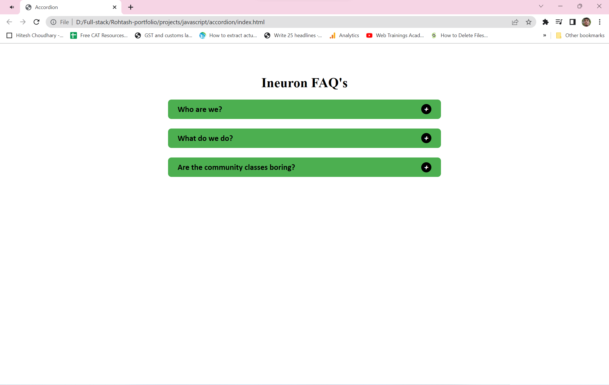
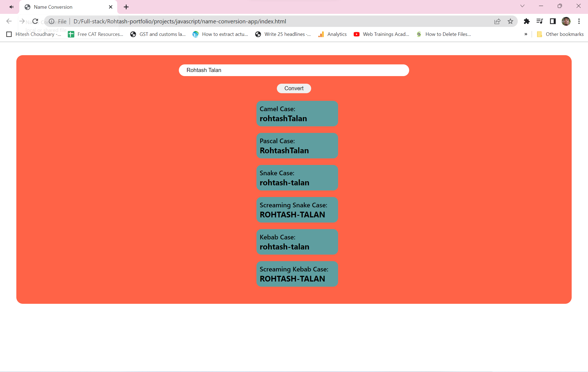
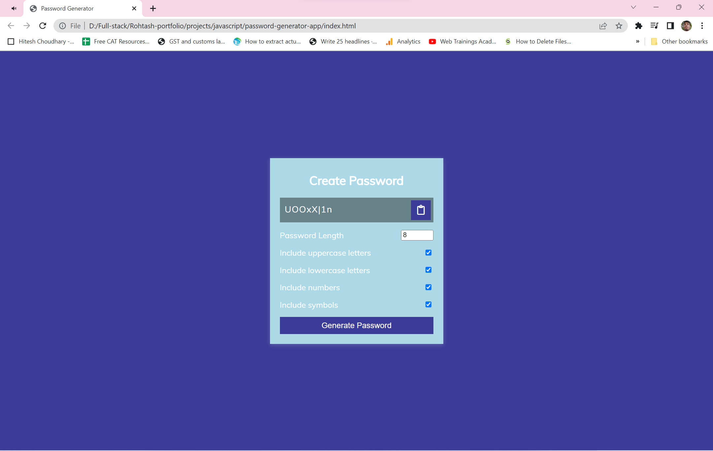
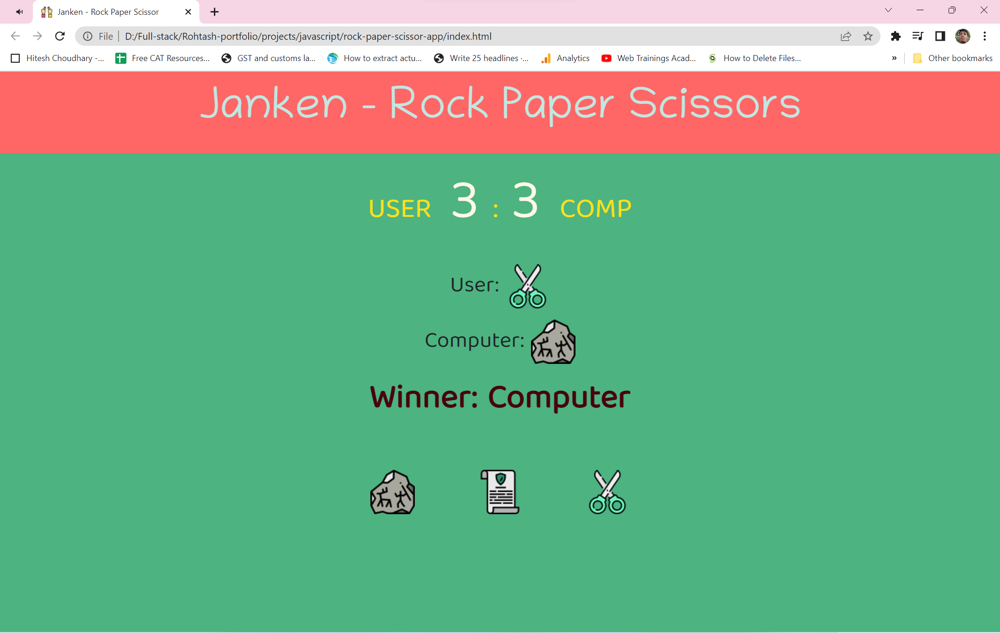
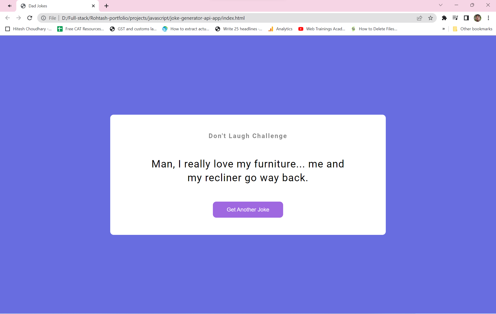
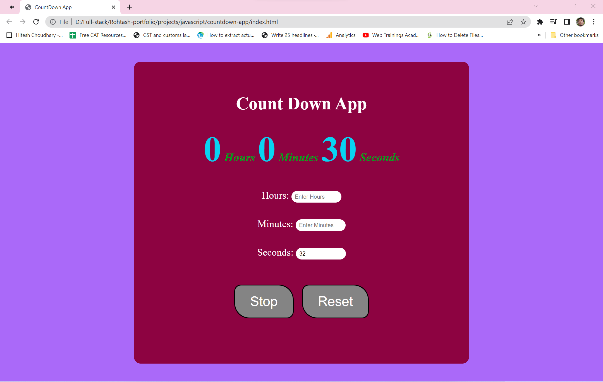
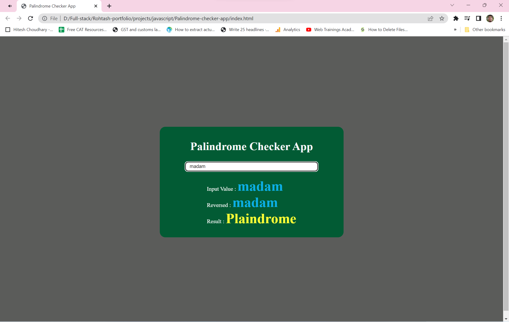
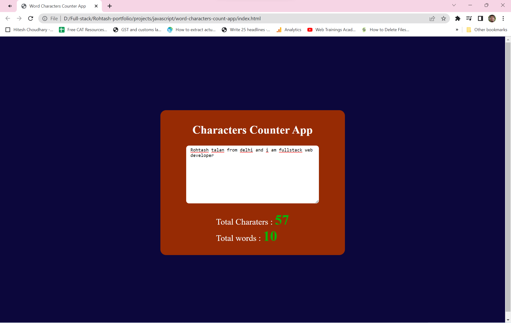

# RØDE-WEBSITE-CLONE

## About

It have 14 assignment based on CRUD(create, read, update and delete) and 20 Dom manuplation using Developer Console over different website under Mentorship of   

## What did I learn by making this project?

- 

##  Time taken ?

## Screenshots

